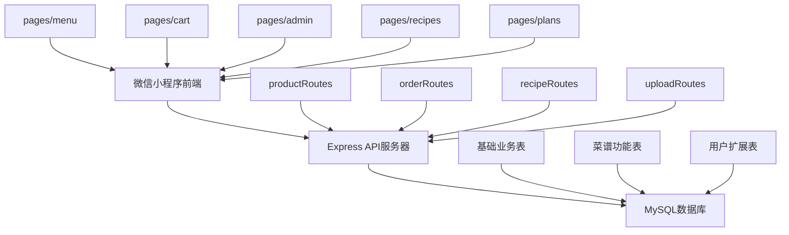

# VERDENT.md
This file provides guidance to Verdent when working with code in this repository.

## Table of Contents
1. Commonly Used Commands
2. High-Level Architecture & Structure
3. Key Rules & Constraints
4. Development Hints

## Commands
- `cd server && npm install` - 安装后端依赖
- `cd server && npm run dev` - 启动开发服务器 (nodemon)
- `cd server && npm start` - 启动生产服务器
- `mysql -u root -p < server/database/init.sql` - 初始化数据库
- 微信开发者工具 - 直接打开项目根目录运行前端

## Architecture

### Major Subsystems & Responsibilities
- **微信小程序前端** (`pages/`, `app.js`, `app.json`)
  - 用户端：菜单浏览、购物车、下单、订单管理
  - 管理端：商品管理、订单管理、分类管理、店铺配置
  - 特色功能：菜谱分享、计划制定、盲盒、游戏化、提醒系统

- **Node.js/Express后端API** (`server/`)
  - RESTful API服务 (端口: 3000)
  - MVC架构：Models(`models/`) + Controllers(`controllers/`) + Routes(`routes/`)
  - 文件上传服务 (`middleware/upload.js`)
  - 数据验证 (Joi)

- **MySQL数据库** (`server/database/`)
  - 6个核心表：categories, products, orders, order_items, users, admins
  - 扩展表：recipes, recipe_plans, user_tags, blind_boxes, reminders 等

### Key Data Flows
```
小程序页面 → app.js全局方法 → HTTP请求 → Express路由 → 控制器 → 数据模型 → MySQL
```

### External Dependencies
- **前端**: 微信小程序原生框架 + 本地存储
- **后端**: Express + mysql2 + multer + joi + cors + moment + uuid
- **数据库**: MySQL 5.7+ with utf8mb4编码

### Development Entry Points
- **前端开发**: 微信开发者工具打开项目根目录
- **后端开发**: `server/app.js` 主入口文件
- **数据库**: `server/database/init.sql` 包含完整表结构和测试数据

### System Architecture


## Key Rules & Constraints

### 微信小程序约束
- 必须使用微信开发者工具开发和调试
- 所有页面路径必须在 `app.json` 的 `pages` 数组中注册
- 图片资源统一放在 `images/` 目录
- 使用本地存储管理购物车状态 (`wx.getStorageSync/setStorageSync`)
- API base URL配置在 `app.js` 的 `globalData.apiBase`

### 后端API约束
- 所有API路由必须在 `server/app.js` 中注册
- 使用Joi验证所有输入数据
- 文件上传限制：5MB，仅支持图片格式 (jpeg, png, gif, webp)
- 数据库连接池配置在 `server/config.js`
- 统一错误响应格式：`{error: true, message: "错误信息"}`

### 数据库约束
- 必须使用 `utf8mb4` 字符集和 `utf8mb4_unicode_ci` 排序规则
- 所有表包含 `created_at` 和 `updated_at` 时间戳
- 外键约束：order_items → products, orders → users
- 订单创建必须使用事务保证数据一致性

### 代码规范 [inferred]
- 微信小程序：使用2空格缩进 (project.config.json中配置)
- 变量命名：小驼峰命名法
- 数据库字段：snake_case命名
- API路径：kebab-case命名

## Development Hints

### 添加新的小程序页面
1. 在 `pages/` 目录创建页面文件夹
2. 创建4个文件：`.wxml`, `.js`, `.json`, `.wxss`
3. 在 `app.json` 的 `pages` 数组中添加页面路径
4. 如需添加到tabBar，在 `app.json` 的 `tabBar.list` 中配置

### 添加新的API端点
1. 在 `server/models/` 创建数据模型（如果需要新表）
2. 在 `server/controllers/` 创建控制器函数
3. 在 `server/routes/` 创建路由文件
4. 在 `server/app.js` 中注册新路由：`app.use('/api/endpoint', routeFile)`
5. 确保在控制器中使用Joi验证输入数据

### 修改数据库结构
1. 编辑 `server/database/init.sql` 添加/修改表结构
2. 更新对应的 `server/models/` 文件
3. 重新运行数据库初始化脚本
4. 更新相关的控制器和API文档

### 扩展现有功能模块
- **菜谱功能**: 基于 `pages/recipes/` 和 `server/routes/recipes.js`
- **计划功能**: 基于 `pages/plans/` 和 `server/routes/recipe-plans.js`
- **用户功能**: 基于 `pages/user/` 和 `server/routes/user.js`
- **盲盒功能**: 基于 `pages/blind-box/` 和 `server/routes/blind-box.js`
- **游戏化**: 基于 `pages/game/` 和 `server/routes/game.js`

### 调试和测试
- **前端调试**: 微信开发者工具控制台
- **后端调试**: 启动dev模式查看nodemon输出
- **API测试**: 直接访问 `http://localhost:3000/api/...` 端点
- **数据库调试**: 检查 `server/config.js` 连接配置