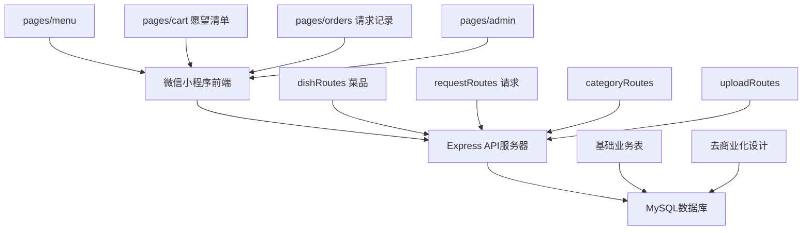

# VERDENT.md
This file provides guidance to Verdent when working with code in this repository.

## Table of Contents
1. Commonly Used Commands
2. High-Level Architecture & Structure
3. Key Rules & Constraints
4. Development Hints

## Commands
- `cd server && npm install` - 安装后端依赖
- `cd server && npm run dev` - 启动开发服务器 (nodemon)
- `cd server && npm start` - 启动生产服务器
- `mysql -u root -p < server/database/init.sql` - 初始化数据库
- `mysql -u root -p < server/database/migrate_decommercialize.sql` - 执行去商业化迁移
- 微信开发者工具 - 直接打开项目根目录运行前端

## Architecture

### 项目定位
去商业化的菜谱分享平台
- 用户可以上传和分享菜谱
- 其他用户可以浏览菜谱并提交"想吃"请求
- 通过请求-响应机制促进分享交流
- 完全免费，无商业交易概念

### Major Subsystems & Responsibilities
- **微信小程序前端** (`pages/`, `app.js`, `app.json`)
  - 用户端：菜品浏览、愿望清单、请求提交、请求记录
  - 管理端：菜品管理、请求管理、分类管理、平台配置

- **Node.js/Express后端API** (`server/`)
  - RESTful API服务 (端口: 3000)
  - MVC架构：Models(`models/`) + Controllers(`controllers/`) + Routes(`routes/`)
  - 文件上传服务 (`middleware/upload.js`)
  - 数据验证 (Joi)

- **MySQL数据库** (`server/database/`)
  - 核心表：categories, menu_items, orders, order_items, users, admins
  - 菜谱功能表：recipes, recipe_reviews (如果需要)

### Key Data Flows
```
小程序页面 → app.js全局方法 → HTTP请求 → Express路由 → 控制器 → 数据模型 → MySQL
```

### 核心概念转换
- 商品 → 菜品
- 购物车 → 愿望清单
- 订单 → 请求
- 付款 → 请求原因
- 发货 → 准备制作

### External Dependencies
- **前端**: 微信小程序原生框架 + 本地存储
- **后端**: Express + mysql2 + multer + joi + cors + moment + uuid
- **数据库**: MySQL 5.7+ with utf8mb4编码

### Development Entry Points
- **前端开发**: 微信开发者工具打开项目根目录
- **后端开发**: `server/app.js` 主入口文件
- **数据库**: `server/database/init.sql` 包含完整表结构和测试数据

### System Architecture


## Key Rules & Constraints

### 微信小程序约束
- 必须使用微信开发者工具开发和调试
- 所有页面路径必须在 `app.json` 的 `pages` 数组中注册
- 图片资源统一放在 `images/` 目录
- 使用本地存储管理愿望清单状态 (`wx.getStorageSync/setStorageSync`)
- API base URL配置在 `app.js` 的 `globalData.apiBase`

### 后端API约束
- 所有API路由必须在 `server/app.js` 中注册
- 使用Joi验证所有输入数据
- 文件上传限制：5MB，仅支持图片格式 (jpeg, png, gif, webp)
- 数据库连接池配置在 `server/config.js`
- 统一错误响应格式：`{success: false, message: "错误信息"}`

### 数据库约束
- 必须使用 `utf8mb4` 字符集和 `utf8mb4_unicode_ci` 排序规则
- 所有表包含 `created_at` 和 `updated_at` 时间戳
- 外键约束：order_items → menu_items, orders → users
- 请求创建必须使用事务保证数据一致性
- **重要**: 已去除所有价格相关字段

### 去商业化约束
- 菜品表 (menu_items) 使用 `dish_name` 字段，无价格字段
- 订单表 (orders) 改为请求语义，使用 `request_no`, `request_status`
- 请求状态：pending, accepted, preparing, ready, declined
- API路由：`/api/dishes`, `/api/requests`, `/api/platform-config`

### 代码规范
- 微信小程序：使用2空格缩进 (project.config.json中配置)
- 变量命名：小驼峰命名法
- 数据库字段：snake_case命名
- API路径：kebab-case命名

## Development Hints

### 添加新的小程序页面
1. 在 `pages/` 目录创建页面文件夹
2. 创建4个文件：`.wxml`, `.js`, `.json`, `.wxss`
3. 在 `app.json` 的 `pages` 数组中添加页面路径
4. 如需添加到tabBar，在 `app.json` 的 `tabBar.list` 中配置

### 添加新的API端点
1. 在 `server/models/` 创建数据模型（如果需要新表）
2. 在 `server/controllers/` 创建控制器函数
3. 在 `server/routes/` 创建路由文件
4. 在 `server/app.js` 中注册新路由：`app.use('/api/endpoint', routeFile)`
5. 确保在控制器中使用Joi验证输入数据

### 修改数据库结构
1. 编辑 `server/database/init.sql` 添加/修改表结构
2. 如需迁移现有数据，使用 `server/database/migrate_decommercialize.sql`
3. 更新对应的 `server/models/` 文件
4. 重新运行数据库初始化脚本
5. 更新相关的控制器和API文档

### 核心功能模块
- **菜品浏览**: `pages/menu/menu` - 浏览菜品，添加到愿望清单
- **愿望清单**: `pages/cart/cart` - 管理想吃的菜品，提交请求
- **请求记录**: `pages/orders/orders` - 查看请求历史和状态
- **请求管理**: `pages/admin/orders/orders` - 管理员处理用户请求

### 调试和测试
- **前端调试**: 微信开发者工具控制台
- **后端调试**: 启动dev模式查看nodemon输出
- **API测试**: 直接访问 `http://localhost:3000/api/...` 端点
- **数据库调试**: 检查 `server/config.js` 连接配置

### 去商业化特点
- **零成本使用**: 没有价格概念，完全免费
- **降低心理门槛**: 请求比下单更轻松
- **增强分享意愿**: 没有金钱压力，促进交流
- **专注体验**: 简化界面，专注菜品分享和需求表达